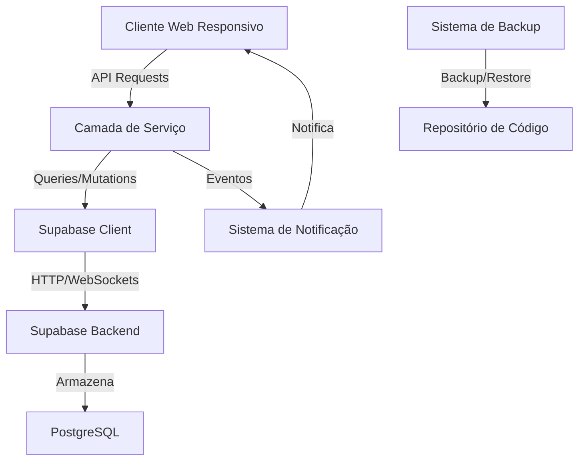

# Design Document

## Overview

Este documento descreve o design técnico para adaptar o aplicativo atual para utilizar o Supabase como banco de dados e garantir que seja responsivo para todos os dispositivos (desktop, tablet e mobile). O design aborda a integração com o Supabase, a migração de dados, o design responsivo, a segurança e o sistema de backup.

## Arquitetura

### Arquitetura Geral



### Componentes Principais

1. **Cliente Web Responsivo**: Interface de usuário adaptável para diferentes dispositivos
2. **Camada de Serviço**: Lógica de negócios e gerenciamento de estado
3. **Supabase Client**: SDK do Supabase para comunicação com o backend
4. **Sistema de Backup**: Mecanismo para backup e restauração do código
5. **Sistema de Notificação**: Gerenciamento de eventos em tempo real

## Componentes e Interfaces

### Cliente Web Responsivo

O cliente web será implementado usando um framework moderno (React, Vue ou Angular) com as seguintes características:

1. **Layout Responsivo**:
   - Utilização de CSS Grid e Flexbox para layouts adaptáveis
   - Media queries para ajustes específicos por tamanho de tela
   - Unidades relativas (rem, %, vh/vw) para dimensionamento flexível

2. **Componentes Adaptáveis**:
   - Menus que se transformam em menus hambúrguer em telas pequenas
   - Tabelas que se adaptam para visualização em dispositivos móveis
   - Formulários que reorganizam campos em diferentes layouts

3. **Otimização de Recursos**:
   - Carregamento lazy de componentes e imagens
   - Minificação e compressão de assets
   - Implementação de service workers para melhor desempenho

### Integração com Supabase

A integração com o Supabase será implementada através do SDK oficial:

1. **Inicialização**:
```javascript
import { createClient } from '@supabase/supabase-js'

const supabase = createClient(
  'https://your-project-url.supabase.co',
  'your-anon-key'
)
```

2. **Interfaces de Serviço**:
```typescript
interface DatabaseService {
  initialize(): Promise<void>;
  query<T>(table: string, query: QueryParams): Promise<T[]>;
  insert<T>(table: string, data: Partial<T>): Promise<T>;
  update<T>(table: string, id: string, data: Partial<T>): Promise<T>;
  delete(table: string, id: string): Promise<void>;
  subscribe(table: string, callback: (payload: any) => void): () => void;
}

class SupabaseService implements DatabaseService {
  // Implementação dos métodos usando o cliente Supabase
}
```

3. **Gerenciamento de Autenticação**:
```typescript
interface AuthService {
  signUp(email: string, password: string): Promise<User>;
  signIn(email: string, password: string): Promise<Session>;
  signOut(): Promise<void>;
  resetPassword(email: string): Promise<void>;
  getCurrentUser(): User | null;
}

class SupabaseAuthService implements AuthService {
  // Implementação dos métodos usando o cliente Supabase
}
```

### Sistema de Backup

O sistema de backup será implementado usando scripts automatizados:

1. **Backup do Código**:
   - Criação de branches Git específicos para backup
   - Scripts para exportação do estado atual do código

2. **Backup do Banco de Dados**:
   - Utilização da API do Supabase para exportação de dados
   - Armazenamento seguro dos backups em local designado

3. **Mecanismo de Restauração**:
   - Scripts para reverter para versões anteriores do código
   - Procedimentos para restauração de dados no Supabase

## Modelos de Dados

### Estrutura do Banco de Dados no Supabase

As tabelas principais no Supabase serão:

1. **users**: Informações dos usuários
   - id (UUID, PK)
   - email (string, unique)
   - name (string)
   - created_at (timestamp)
   - updated_at (timestamp)

2. **profiles**: Perfis de usuário
   - id (UUID, PK, FK -> users.id)
   - avatar_url (string, nullable)
   - bio (text, nullable)
   - preferences (jsonb)

3. **content**: Conteúdo do aplicativo
   - id (UUID, PK)
   - title (string)
   - body (text)
   - user_id (UUID, FK -> users.id)
   - created_at (timestamp)
   - updated_at (timestamp)

4. **interactions**: Interações dos usuários com o conteúdo
   - id (UUID, PK)
   - user_id (UUID, FK -> users.id)
   - content_id (UUID, FK -> content.id)
   - type (string)
   - created_at (timestamp)

### Políticas de Segurança RLS (Row Level Security)

```sql
-- Exemplo de política para a tabela content
CREATE POLICY "Usuários podem ler qualquer conteúdo"
  ON content FOR SELECT
  USING (true);

CREATE POLICY "Usuários só podem editar seu próprio conteúdo"
  ON content FOR UPDATE
  USING (auth.uid() = user_id);

CREATE POLICY "Usuários só podem deletar seu próprio conteúdo"
  ON content FOR DELETE
  USING (auth.uid() = user_id);
```

## Tratamento de Erros

### Estratégia de Tratamento de Erros

1. **Erros de Conexão**:
   - Implementação de retry com backoff exponencial
   - Feedback visual para o usuário sobre o estado da conexão
   - Cache temporário de operações para tentar novamente quando a conexão for restabelecida

2. **Erros de Validação**:
   - Validação no cliente antes de enviar ao servidor
   - Feedback imediato para o usuário sobre erros de validação
   - Tratamento adequado de mensagens de erro do Supabase

3. **Erros de Autenticação**:
   - Redirecionamento para tela de login quando a sessão expirar
   - Mensagens claras sobre problemas de autenticação
   - Mecanismo de refresh token automático

### Logging e Monitoramento

1. **Sistema de Logging**:
   - Logs estruturados com níveis de severidade
   - Captura de informações contextuais (usuário, ação, timestamp)
   - Filtros para informações sensíveis

2. **Monitoramento**:
   - Integração com ferramentas de monitoramento
   - Alertas para erros críticos
   - Dashboard para visualização de métricas de desempenho

## Estratégia de Testes

### Testes Unitários

1. **Componentes UI**:
   - Testes de renderização para diferentes tamanhos de tela
   - Testes de interação do usuário
   - Testes de acessibilidade

2. **Serviços**:
   - Testes de integração com o Supabase (usando mocks)
   - Testes de lógica de negócios
   - Testes de tratamento de erros

### Testes de Integração

1. **Fluxos de Usuário**:
   - Testes end-to-end para fluxos críticos
   - Testes de autenticação e autorização
   - Testes de migração de dados

2. **Responsividade**:
   - Testes automatizados em diferentes tamanhos de tela
   - Testes de performance em dispositivos móveis
   - Testes de usabilidade

### Testes de Migração

1. **Validação de Dados**:
   - Verificação de integridade após migração
   - Comparação de contagens e somas de verificação
   - Testes de regressão após migração

## Considerações de Segurança

1. **Autenticação e Autorização**:
   - Utilização do sistema de autenticação do Supabase
   - Implementação de Row Level Security (RLS)
   - Tokens JWT para autenticação de API

2. **Proteção de Dados**:
   - Criptografia em trânsito (HTTPS)
   - Sanitização de inputs para prevenir injeção SQL
   - Validação de dados no cliente e servidor

3. **Auditoria**:
   - Logs de ações críticas
   - Rastreamento de alterações em dados sensíveis
   - Monitoramento de tentativas de acesso não autorizado