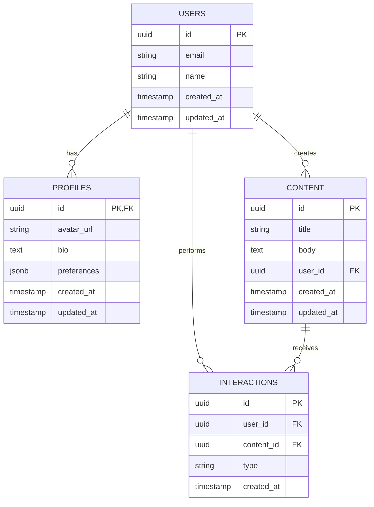

# Estrutura do Banco de Dados

Este documento descreve a estrutura do banco de dados para o aplicativo, implementado no Supabase.

## Modelo de Dados

### Diagrama ER



## Tabelas

### users

Armazena informações básicas sobre os usuários do sistema.

| Coluna      | Tipo                    | Descrição                           |
|-------------|-------------------------|-------------------------------------|
| id          | UUID                    | Identificador único (chave primária) |
| email       | VARCHAR(255)            | Email do usuário (único)            |
| name        | VARCHAR(255)            | Nome do usuário                     |
| created_at  | TIMESTAMP WITH TIME ZONE | Data de criação do registro         |
| updated_at  | TIMESTAMP WITH TIME ZONE | Data da última atualização          |

### profiles

Armazena informações adicionais sobre os usuários.

| Coluna      | Tipo                    | Descrição                           |
|-------------|-------------------------|-------------------------------------|
| id          | UUID                    | Identificador único (chave primária, referencia users.id) |
| avatar_url  | TEXT                    | URL da imagem de avatar do usuário  |
| bio         | TEXT                    | Biografia ou descrição do usuário   |
| preferences | JSONB                   | Preferências do usuário em formato JSON |
| created_at  | TIMESTAMP WITH TIME ZONE | Data de criação do registro         |
| updated_at  | TIMESTAMP WITH TIME ZONE | Data da última atualização          |

### content

Armazena o conteúdo criado pelos usuários.

| Coluna      | Tipo                    | Descrição                           |
|-------------|-------------------------|-------------------------------------|
| id          | UUID                    | Identificador único (chave primária) |
| title       | VARCHAR(255)            | Título do conteúdo                  |
| body        | TEXT                    | Corpo do conteúdo                   |
| user_id     | UUID                    | ID do usuário que criou o conteúdo (chave estrangeira) |
| created_at  | TIMESTAMP WITH TIME ZONE | Data de criação do registro         |
| updated_at  | TIMESTAMP WITH TIME ZONE | Data da última atualização          |

### interactions

Armazena interações dos usuários com o conteúdo (likes, comentários, compartilhamentos, etc.).

| Coluna      | Tipo                    | Descrição                           |
|-------------|-------------------------|-------------------------------------|
| id          | UUID                    | Identificador único (chave primária) |
| user_id     | UUID                    | ID do usuário que realizou a interação (chave estrangeira) |
| content_id  | UUID                    | ID do conteúdo que recebeu a interação (chave estrangeira) |
| type        | VARCHAR(50)             | Tipo de interação (like, comment, share, etc.) |
| created_at  | TIMESTAMP WITH TIME ZONE | Data de criação do registro         |

## Índices

Para otimizar o desempenho das consultas, os seguintes índices foram criados:

| Nome                      | Tabela       | Coluna(s)   | Descrição                           |
|---------------------------|--------------|-------------|-------------------------------------|
| idx_content_user_id       | content      | user_id     | Acelera consultas que filtram conteúdo por usuário |
| idx_interactions_user_id  | interactions | user_id     | Acelera consultas que filtram interações por usuário |
| idx_interactions_content_id | interactions | content_id | Acelera consultas que filtram interações por conteúdo |
| idx_interactions_type     | interactions | type        | Acelera consultas que filtram interações por tipo |

## Triggers e Funções

### update_updated_at()

Função que atualiza automaticamente o campo `updated_at` sempre que um registro é modificado.

```sql
CREATE OR REPLACE FUNCTION update_updated_at()
RETURNS TRIGGER AS $$
BEGIN
  NEW.updated_at = NOW();
  RETURN NEW;
END;
$$ LANGUAGE plpgsql;
```

Esta função é utilizada pelos seguintes triggers:

- `update_users_updated_at`: Atualiza o campo `updated_at` na tabela `users`
- `update_profiles_updated_at`: Atualiza o campo `updated_at` na tabela `profiles`
- `update_content_updated_at`: Atualiza o campo `updated_at` na tabela `content`

## Políticas de Segurança (RLS)

O Supabase utiliza Row Level Security (RLS) para controlar o acesso aos dados. As seguintes políticas foram implementadas:

### users

- **Leitura**: Qualquer usuário autenticado pode ler informações de qualquer usuário
- **Atualização**: Usuários só podem atualizar seus próprios registros

### profiles

- **Leitura**: Qualquer usuário autenticado pode ler informações de qualquer perfil
- **Atualização**: Usuários só podem atualizar seus próprios perfis

### content

- **Leitura**: Qualquer usuário autenticado pode ler qualquer conteúdo
- **Inserção**: Usuários podem inserir conteúdo associado ao seu próprio ID
- **Atualização**: Usuários só podem atualizar seu próprio conteúdo
- **Exclusão**: Usuários só podem excluir seu próprio conteúdo

### interactions

- **Leitura**: Qualquer usuário autenticado pode ler qualquer interação
- **Inserção**: Usuários podem inserir interações associadas ao seu próprio ID
- **Atualização**: Usuários só podem atualizar suas próprias interações
- **Exclusão**: Usuários só podem excluir suas próprias interações