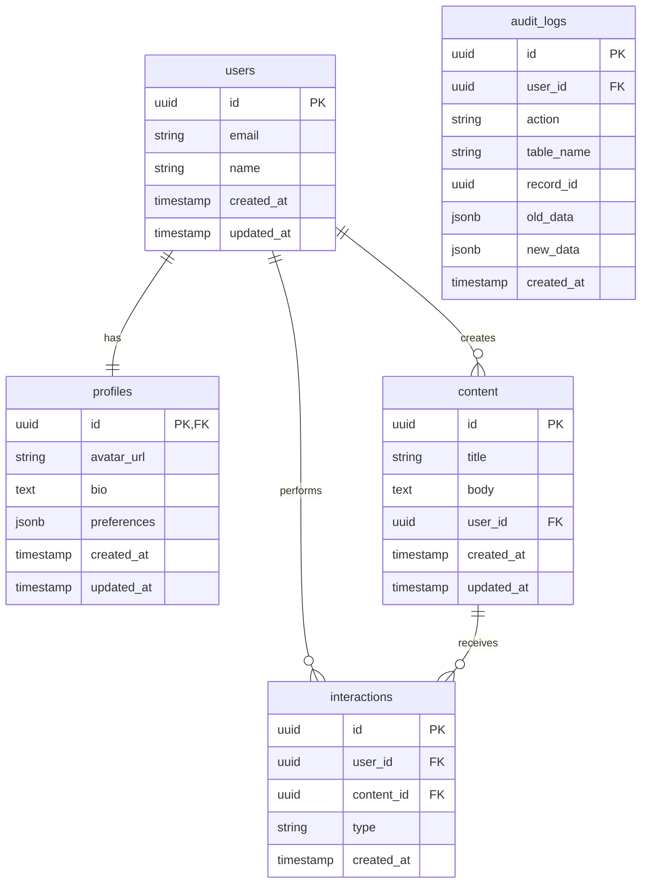

# Estrutura do Banco de Dados

## Visão Geral

Este documento descreve em detalhes a estrutura do banco de dados PostgreSQL utilizado pelo Supabase em nosso aplicativo. O banco de dados foi projetado para suportar todas as funcionalidades do aplicativo, incluindo gerenciamento de usuários, conteúdo e interações, com foco em desempenho e segurança.

## Esquema do Banco de Dados

### Diagrama ER



## Tabelas

### 1. users

Armazena informações básicas dos usuários.

#### Estrutura

| Campo      | Tipo      | Restrições                | Descrição                           |
|------------|-----------|---------------------------|-------------------------------------|
| id         | UUID      | PRIMARY KEY               | Identificador único                 |
| email      | VARCHAR   | NOT NULL, UNIQUE          | Email do usuário                    |
| name       | VARCHAR   | NOT NULL                  | Nome do usuário                     |
| created_at | TIMESTAMP | DEFAULT NOW()             | Data de criação do registro         |
| updated_at | TIMESTAMP | DEFAULT NOW()             | Data da última atualização          |

#### Índices

- `users_pkey`: Índice primário no campo `id`
- `users_email_idx`: Índice único no campo `email` para buscas rápidas por email

#### SQL de Criação

```sql
CREATE TABLE public.users (
    id UUID PRIMARY KEY DEFAULT uuid_generate_v4(),
    email VARCHAR NOT NULL UNIQUE,
    name VARCHAR NOT NULL,
    created_at TIMESTAMP WITH TIME ZONE DEFAULT NOW(),
    updated_at TIMESTAMP WITH TIME ZONE DEFAULT NOW()
);

CREATE INDEX users_email_idx ON public.users (email);
```

### 2. profiles

Armazena informações adicionais do perfil do usuário.

#### Estrutura

| Campo       | Tipo      | Restrições                | Descrição                                  |
|-------------|-----------|---------------------------|-------------------------------------------|
| id          | UUID      | PRIMARY KEY, FOREIGN KEY  | Identificador único (FK para users.id)     |
| avatar_url  | VARCHAR   |                           | URL da imagem de avatar (opcional)         |
| bio         | TEXT      |                           | Biografia do usuário (opcional)            |
| preferences | JSONB     |                           | Preferências do usuário em formato JSON    |
| created_at  | TIMESTAMP | DEFAULT NOW()             | Data de criação do registro                |
| updated_at  | TIMESTAMP | DEFAULT NOW()             | Data da última atualização                 |

#### Índices

- `profiles_pkey`: Índice primário no campo `id`

#### SQL de Criação

```sql
CREATE TABLE public.profiles (
    id UUID PRIMARY KEY REFERENCES public.users(id),
    avatar_url VARCHAR,
    bio TEXT,
    preferences JSONB,
    created_at TIMESTAMP WITH TIME ZONE DEFAULT NOW(),
    updated_at TIMESTAMP WITH TIME ZONE DEFAULT NOW()
);
```

### 3. content

Armazena o conteúdo criado pelos usuários.

#### Estrutura

| Campo      | Tipo      | Restrições                | Descrição                               |
|------------|-----------|---------------------------|----------------------------------------|
| id         | UUID      | PRIMARY KEY               | Identificador único                     |
| title      | VARCHAR   | NOT NULL                  | Título do conteúdo                      |
| body       | TEXT      | NOT NULL                  | Corpo do conteúdo                       |
| user_id    | UUID      | FOREIGN KEY               | ID do usuário que criou o conteúdo      |
| created_at | TIMESTAMP | DEFAULT NOW()             | Data de criação do registro             |
| updated_at | TIMESTAMP | DEFAULT NOW()             | Data da última atualização              |

#### Índices

- `content_pkey`: Índice primário no campo `id`
- `content_user_id_idx`: Índice no campo `user_id` para buscas rápidas por usuário
- `content_created_at_idx`: Índice no campo `created_at` para ordenação por data

#### SQL de Criação

```sql
CREATE TABLE public.content (
    id UUID PRIMARY KEY DEFAULT uuid_generate_v4(),
    title VARCHAR NOT NULL,
    body TEXT NOT NULL,
    user_id UUID NOT NULL REFERENCES public.users(id),
    created_at TIMESTAMP WITH TIME ZONE DEFAULT NOW(),
    updated_at TIMESTAMP WITH TIME ZONE DEFAULT NOW()
);

CREATE INDEX content_user_id_idx ON public.content (user_id);
CREATE INDEX content_created_at_idx ON public.content (created_at);
```

### 4. interactions

Armazena interações dos usuários com o conteúdo.

#### Estrutura

| Campo      | Tipo      | Restrições                | Descrição                                  |
|------------|-----------|---------------------------|-------------------------------------------|
| id         | UUID      | PRIMARY KEY               | Identificador único                        |
| user_id    | UUID      | FOREIGN KEY               | ID do usuário que interagiu                |
| content_id | UUID      | FOREIGN KEY               | ID do conteúdo relacionado                 |
| type       | VARCHAR   | NOT NULL                  | Tipo de interação (like, comment, etc.)    |
| created_at | TIMESTAMP | DEFAULT NOW()             | Data de criação do registro                |

#### Índices

- `interactions_pkey`: Índice primário no campo `id`
- `interactions_user_id_idx`: Índice no campo `user_id` para buscas rápidas por usuário
- `interactions_content_id_idx`: Índice no campo `content_id` para buscas rápidas por conteúdo
- `interactions_type_idx`: Índice no campo `type` para filtrar por tipo de interação

#### SQL de Criação

```sql
CREATE TABLE public.interactions (
    id UUID PRIMARY KEY DEFAULT uuid_generate_v4(),
    user_id UUID NOT NULL REFERENCES public.users(id),
    content_id UUID NOT NULL REFERENCES public.content(id),
    type VARCHAR NOT NULL,
    created_at TIMESTAMP WITH TIME ZONE DEFAULT NOW()
);

CREATE INDEX interactions_user_id_idx ON public.interactions (user_id);
CREATE INDEX interactions_content_id_idx ON public.interactions (content_id);
CREATE INDEX interactions_type_idx ON public.interactions (type);
```

### 5. audit_logs

Armazena logs de auditoria para operações sensíveis.

#### Estrutura

| Campo      | Tipo      | Restrições                | Descrição                                  |
|------------|-----------|---------------------------|-------------------------------------------|
| id         | UUID      | PRIMARY KEY               | Identificador único                        |
| user_id    | UUID      | FOREIGN KEY               | ID do usuário que realizou a ação          |
| action     | VARCHAR   | NOT NULL                  | Tipo de ação (INSERT, UPDATE, DELETE)      |
| table_name | VARCHAR   | NOT NULL                  | Nome da tabela afetada                     |
| record_id  | UUID      | NOT NULL                  | ID do registro afetado                     |
| old_data   | JSONB     |                           | Dados antigos (para UPDATE e DELETE)       |
| new_data   | JSONB     |                           | Dados novos (para INSERT e UPDATE)         |
| created_at | TIMESTAMP | DEFAULT NOW()             | Data da ação                               |

#### Índices

- `audit_logs_pkey`: Índice primário no campo `id`
- `audit_logs_user_id_idx`: Índice no campo `user_id`
- `audit_logs_table_name_idx`: Índice no campo `table_name`
- `audit_logs_created_at_idx`: Índice no campo `created_at`

#### SQL de Criação

```sql
CREATE TABLE public.audit_logs (
    id UUID PRIMARY KEY DEFAULT uuid_generate_v4(),
    user_id UUID REFERENCES public.users(id),
    action VARCHAR(50) NOT NULL,
    table_name VARCHAR(50) NOT NULL,
    record_id UUID NOT NULL,
    old_data JSONB,
    new_data JSONB,
    created_at TIMESTAMP WITH TIME ZONE DEFAULT NOW()
);

CREATE INDEX audit_logs_user_id_idx ON public.audit_logs (user_id);
CREATE INDEX audit_logs_table_name_idx ON public.audit_logs (table_name);
CREATE INDEX audit_logs_created_at_idx ON public.audit_logs (created_at);
```

## Triggers e Funções

### 1. Atualização Automática de `updated_at`

```sql
CREATE OR REPLACE FUNCTION update_updated_at()
RETURNS TRIGGER AS $$
BEGIN
    NEW.updated_at = NOW();
    RETURN NEW;
END;
$$ LANGUAGE plpgsql;

CREATE TRIGGER update_users_updated_at
BEFORE UPDATE ON public.users
FOR EACH ROW EXECUTE FUNCTION update_updated_at();

CREATE TRIGGER update_profiles_updated_at
BEFORE UPDATE ON public.profiles
FOR EACH ROW EXECUTE FUNCTION update_updated_at();

CREATE TRIGGER update_content_updated_at
BEFORE UPDATE ON public.content
FOR EACH ROW EXECUTE FUNCTION update_updated_at();
```

### 2. Auditoria de Alterações

```sql
CREATE OR REPLACE FUNCTION audit_content_changes()
RETURNS TRIGGER AS $$
BEGIN
    IF TG_OP = 'INSERT' THEN
        INSERT INTO public.audit_logs (user_id, action, table_name, record_id, new_data)
        VALUES (auth.uid(), TG_OP, 'content', NEW.id, row_to_json(NEW));
    ELSIF TG_OP = 'UPDATE' THEN
        INSERT INTO public.audit_logs (user_id, action, table_name, record_id, old_data, new_data)
        VALUES (auth.uid(), TG_OP, 'content', NEW.id, row_to_json(OLD), row_to_json(NEW));
    ELSIF TG_OP = 'DELETE' THEN
        INSERT INTO public.audit_logs (user_id, action, table_name, record_id, old_data)
        VALUES (auth.uid(), TG_OP, 'content', OLD.id, row_to_json(OLD));
    END IF;
    RETURN NULL;
END;
$$ LANGUAGE plpgsql;

CREATE TRIGGER audit_content_trigger
AFTER INSERT OR UPDATE OR DELETE ON public.content
FOR EACH ROW EXECUTE FUNCTION audit_content_changes();
```

### 3. Função para Verificar Administrador

```sql
CREATE OR REPLACE FUNCTION is_admin()
RETURNS BOOLEAN AS $$
BEGIN
    RETURN (
        SELECT EXISTS (
            SELECT 1
            FROM public.users
            WHERE id = auth.uid() AND role = 'admin'
        )
    );
END;
$$ LANGUAGE plpgsql;
```

## Estratégia de Indexação

A estratégia de indexação foi projetada para otimizar as consultas mais comuns:

1. **Índices de Chave Primária**: Todas as tabelas têm índices de chave primária para acesso rápido por ID.

2. **Índices de Chave Estrangeira**: Campos que são chaves estrangeiras têm índices para otimizar junções.

3. **Índices de Campos de Filtro**: Campos frequentemente usados em cláusulas WHERE têm índices.

4. **Índices de Ordenação**: Campos frequentemente usados em cláusulas ORDER BY têm índices.

## Otimizações de Consulta

### 1. Consultas Paginadas

Para conjuntos grandes de dados, todas as consultas implementam paginação:

```sql
SELECT * FROM content
ORDER BY created_at DESC
LIMIT 10 OFFSET 0;
```

### 2. Consultas com Junções Otimizadas

Para consultas que envolvem múltiplas tabelas, são utilizadas junções otimizadas:

```sql
SELECT c.*, u.name as user_name
FROM content c
JOIN users u ON c.user_id = u.id
WHERE c.created_at > '2023-01-01'
ORDER BY c.created_at DESC
LIMIT 10;
```

### 3. Consultas com Agregação

Para consultas que envolvem contagens ou outras agregações:

```sql
SELECT c.id, c.title, COUNT(i.id) as like_count
FROM content c
LEFT JOIN interactions i ON c.id = i.content_id AND i.type = 'like'
GROUP BY c.id, c.title
ORDER BY like_count DESC
LIMIT 10;
```

## Considerações de Desempenho

1. **Monitoramento de Consultas Lentas**: Consultas que levam mais de 300ms são registradas e analisadas para otimização.

2. **Análise de Planos de Execução**: Planos de execução são analisados regularmente para identificar oportunidades de otimização.

3. **Vacuum e Analyze**: Operações de vacuum e analyze são executadas regularmente para manter as estatísticas do banco de dados atualizadas.

4. **Particionamento**: Para tabelas que crescem muito (como `interactions` e `audit_logs`), considerar particionamento por data.

## Backup e Recuperação

1. **Backups Automáticos**: O Supabase realiza backups automáticos diários.

2. **Backups Manuais**: Backups manuais podem ser realizados através do painel do Supabase ou via API.

3. **Point-in-Time Recovery**: O Supabase suporta recuperação para um ponto específico no tempo.

4. **Procedimento de Restauração**: Em caso de necessidade de restauração, seguir o procedimento documentado no painel do Supabase.